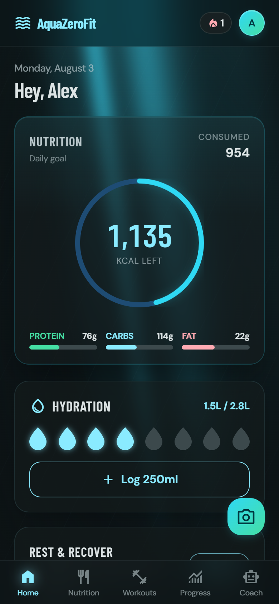
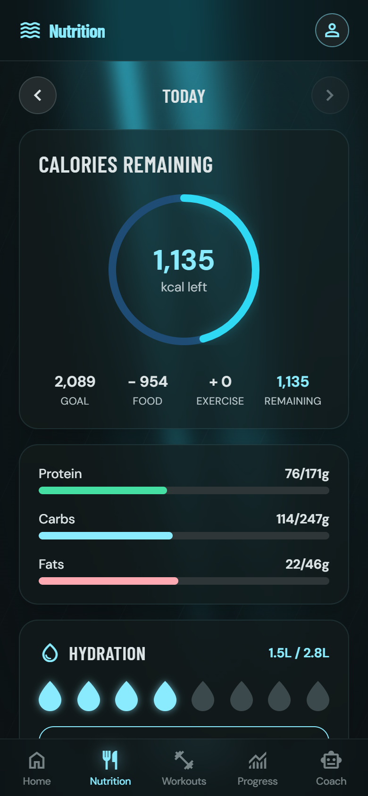
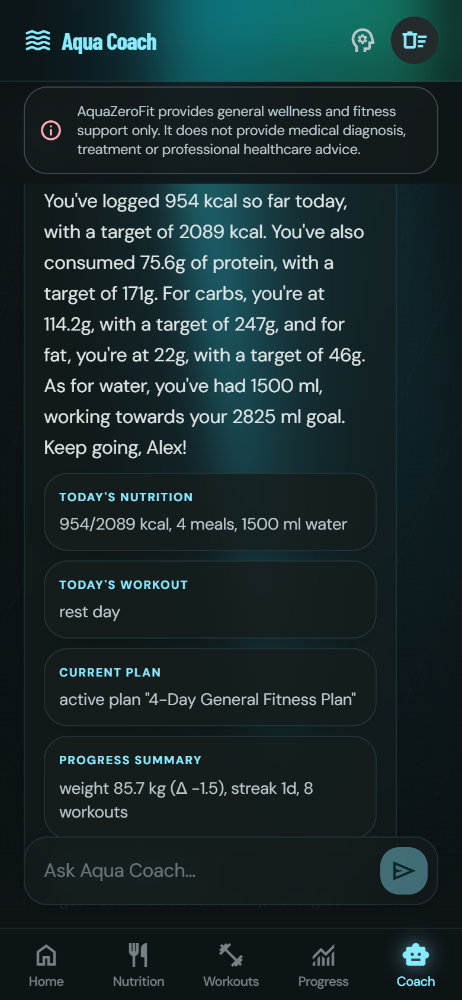
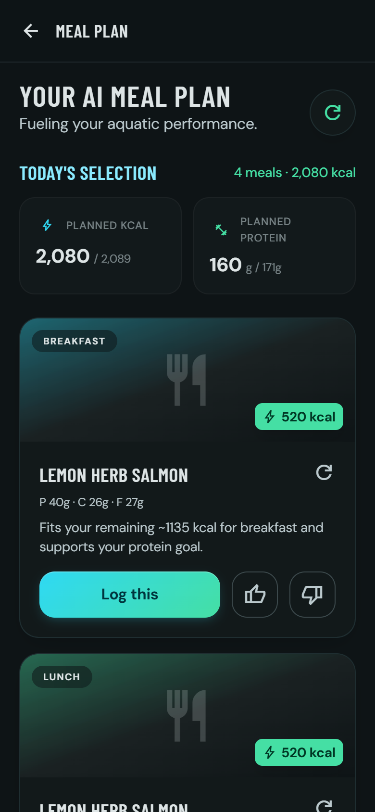
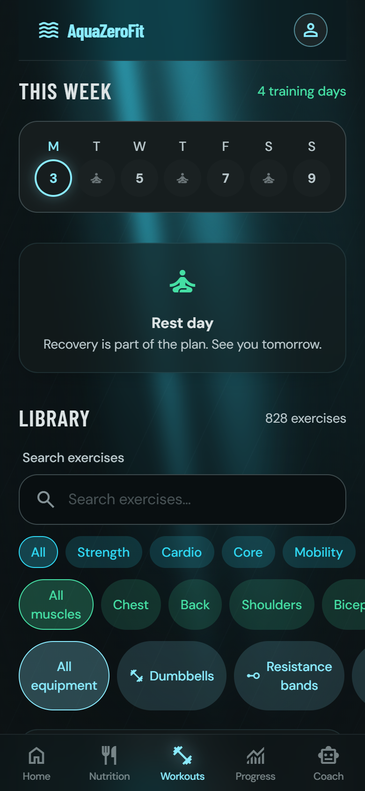
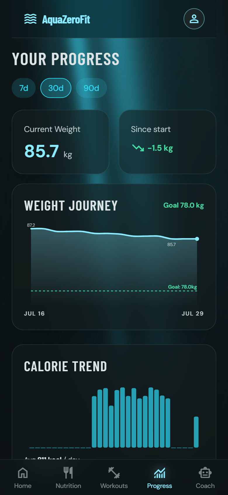

# AquaZeroFit

[](../../actions/workflows/ci.yml)
[](LICENSE)
[](package.json)

AI-powered wellness platform under the **AquaZero** brand. Users build a wellness profile, log meals manually or by photograph, and receive personalised calorie targets, meal suggestions and home training plans that adapt to measured progress. A conversational assistant ("Aqua Coach") answers nutrition and fitness questions inside strict safety boundaries.

> AquaZeroFit provides general wellness and fitness support only. It does not provide medical diagnosis, treatment or professional healthcare advice. This boundary is a product requirement, not a disclaimer (AQF-02 §1).

One React codebase delivers **two targets**: a responsive web application (the assessed surface) and a **Telegram Mini App** (theme binding + native controls when launched inside Telegram).

## The product

Captured from the running application (`npm run api` + `npm run dev`) signed in as the
seeded demo account — not mockups. Design references for each screen live in
`design/figma/`.

| Dashboard | Nutrition | Aqua Coach |
| :---: | :---: | :---: |
|  |  |  |
| Deterministic calorie maths, macro split and hydration for the day | Per-meal logging with a searchable food corpus and day navigation | Conversational coach grounded in the user's real context, with the wellness boundary always visible |

| AI meal plan | Workout library | Progress |
| :---: | :---: | :---: |
|  |  |  |
| Suggestions generated against the user's targets and allergen exclusions | Exercise corpus with per-record licence attribution preserved | Weight journey and calorie trend over 7/30/90 days |

Also captured: [welcome](docs/screenshots/01-welcome.png), [sign-in](docs/screenshots/02-sign-in.png),
[meal photo capture](docs/screenshots/05-capture-meal.png) and [settings](docs/screenshots/10-settings.png).

## Repository layout

```
apps/web           React 18 + TypeScript + Vite + Tailwind — both delivery targets
apps/api           Node.js + TypeScript API implementing the /api/v1 contract (AQF-07)
packages/shared    Shared types, zod validation schemas, error taxonomy, constants
prompts/           Versioned AI prompt files P-01..P-11 (AQF-10)
evals/             Safety evaluation sets and runner (pipeline gate)
content/           Licensing attribution and workout-media governance
docs/specs/        AQF-01..AQF-22 document set
docs/research/     Upstream integration and licensing research tracks
docs/plans/        Integration and delivery plans
design/figma/      Screen references and the Modern Aquatic Wellness design system
design/brand/      Brand assets
tools/docgen/      Markdown to .docx renderer (build tooling, not a workspace)
tools/screenshots/ Re-encodes docs/screenshots into the WebP used by the landing page
```

`prompts/` and `evals/` must stay at the repository root: `apps/api/src/modules/ai/prompts.ts`
resolves prompt files by walking up the directory tree, and `evals/runner.ts` loads its
fixtures as siblings. Moving either silently breaks prompt loading.

`tools/docgen` is deliberately excluded from the npm workspaces so its `docx` dependency
never enters the deployed application's dependency tree. Install it separately if you need
to regenerate a document.

## Quick start

```bash
npm install
npm run api    # API on http://localhost:4000 (seeds demo data on first boot)
npm run dev    # Web app on http://localhost:5173 (proxies /api to :4000)
```

Demo account (seeded in every environment so the product opens populated, AQF-06 §7):

- **Email:** `demo@aquazero.fit`
- **Password:** `AquaZeroDemo!2026`

Other commands:

```bash
npm run build      # typecheck + production build of every workspace
npm run test       # unit + integration suites (vitest)
npm run seed       # re-run content/demo seeding
```

## Architecture in one paragraph

The frontend detects at bootstrap whether it is running inside Telegram (`isTMA()`): in the browser it renders the AquaZero design system directly; inside Telegram it additionally binds the client theme variables. The API is a stateless TypeScript service exposing the frozen `/api/v1` contract with JWT access tokens and single-use rotating refresh tokens (family revocation on reuse). Data is stored as documents in logical containers (`users`, `profiles`, `logs`, `plans`, `content`, `ai`, `ledger`, `audit`) behind a storage abstraction: a JSON file store by default, and Postgres when `DATABASE_URL` is set (a single `documents(container, id, doc jsonb)` table, write-through from an in-memory working set). Because each instance hydrates its own working set, the Postgres store is durable for **single-instance** deployments only — scale out requires moving reads off the local copy (AQF-04, AQF-22). All model access goes through a single AI gateway module with logical model groups (`visionPrimary`, `chatFast`, `planStructured`, `safetyCheap`, `insightBatch`); when no provider keys are configured the gateway falls back to a deterministic offline engine so every core journey works without external AI. Every model-calling endpoint enforces the admission sequence: authenticate → rate limit → tier/credit check → input guardrail → gateway → output guardrail and numeric rules → respond + telemetry (AQF-07 §4).

### Safety invariants (enforced in code, tested)

- Models identify, interpret, explain; **code calculates, filters, enforces**. Calorie math is deterministic lookup-and-multiply.
- Calorie targets are clamped to configured floors with a visible advisory (FR-031).
- Allergen exclusion is a deterministic filter with zero tolerance for false negatives.
- Meal photo recognition never commits a log without explicit user confirmation (FR-013).
- The assistant refuses medical/crisis/extreme-diet content with a supportive signpost (FR-045).
- The credit ledger is append-only; balances are derived by folding transactions.

## Configuration

Environment variables (all optional in development - dev defaults apply). Copy `.env.example` to `.env` and fill in your keys:

```bash
cp .env.example .env
```

The `.env` file is gitignored and must never be committed. The API loads it automatically at boot via `dotenv`.

### Runtime

| Variable | Purpose |
| --- | --- |
| `PORT` | API port (default 4000) |
| `DATABASE_URL` | Postgres connection string. When set, the store switches from JSON files to Postgres; leave unset for local development |
| `AZF_DATA_DIR` | Data directory for the local JSON store (default `apps/api/.data`; used only when `DATABASE_URL` is unset) |
| `SERVE_WEB` | Set to `false` for an API-only deployment. By default the API also serves the built SPA from `apps/web/dist`, so one process serves the whole product on one origin |
| `WEB_DIST_DIR` | Override where the built SPA is found |
| `TRUST_PROXY` | Proxy hops to trust for `req.ip` (defaults to 1 in production, 0 otherwise). Wrong values collapse every caller into one rate-limit bucket |
| `APP_VERSION` | Build identity returned by `/health` and `/ready` |
| `AZF_SEED_DEMO` | Set to `false` to skip demo/admin account seeding (accounts are never seeded in production) |
| `ADMIN_PASSWORD` | Production-only: seeds the admin account with this password; without it no admin account is created |
| `EXPOSE_DEV_TOKENS` | Dev-only: echo password-reset tokens in API responses/logs when `true` (requires non-production `NODE_ENV`) |
| `ENABLE_LLM_SAFETY` | Override LLM second stage for input guardrails (`true`/`false`; defaults on when any AI provider key is set) |
| `CORS_ORIGINS` | Comma-separated allowed CORS origins |

### Security (required in production)

| Variable | Purpose |
| --- | --- |
| `JWT_ACCESS_SECRET` | Access-token signing secret (**required in production**; refresh tokens are opaque randoms and need no secret) |
| `TELEGRAM_BOT_TOKEN` | Bot token for Mini App launch-data validation (dev default `dev-bot-token`; **required in production**) |

### AI Provider Keys (all optional - gateway falls back to offline engine)

The gateway tries providers in order and falls back to a deterministic mock engine when none are available. Put in only the keys you have.

| Variable | Provider | Notes |
| --- | --- | --- |
| `GROQ_API_KEY` | Groq | https://console.groq.com/keys |
| `GEMINI_API_KEY` | Google Gemini | https://aistudio.google.com/apikey |
| `OPENAI_API_KEY` | OpenAI | https://platform.openai.com/api-keys |
| `NVIDIA_API_KEY` | NVIDIA NIM | https://build.nvidia.com/ |
| `NVIDIA_BASE_URL` | NVIDIA NIM | Override endpoint (default `https://integrate.api.nvidia.com/v1`) |
| `OLLAMA_API_KEY` | Ollama | Optional - local Ollama needs no auth |
| `OLLAMA_BASE_URL` | Ollama | Override endpoint (default `http://localhost:11434/v1`) |

## Documentation

The authoritative document set lives in `docs/specs/` (AQF-01 Charter … AQF-22 Deployment Guide). The API surface is specified in AQF-07; algorithms in AQF-09; the prompt bank and LLMOps plan in AQF-10; safety and privacy design in AQF-11; deployment and domain setup in AQF-22.

## Security notes

Accepted tradeoffs for the capstone deployment, reviewed and documented rather than hidden:

- **Tokens in localStorage** — the app runs as a Telegram Mini App where cookie-based sessions are impractical; access tokens are short-lived (15 min) and refresh tokens are single-use, rotated, family-revoked on reuse, and stored server-side only as sha256 hashes.
- **Pure-JS bcrypt at cost 10** (`bcryptjs`) — the portability floor for this capstone; a native binding and/or higher cost factor is the first hardening step for real production load.
- **Client-declared MIME with extension-derived content type** for meal-photo uploads — uploads are size-capped, allowlisted (jpeg/png/heic), stored under unguessable UUID names, never statically served, streamed only to their authenticated owner, and deleted on confirm/failure plus a 24 h TTL sweep.

To report a vulnerability, see [SECURITY.md](SECURITY.md) — please do not open a public issue.

## Contributing

See [CONTRIBUTING.md](CONTRIBUTING.md). Run `npm run verify` (typecheck → tests → safety eval) before opening a pull request; it is exactly what CI runs.

## Licence

Copyright (C) 2026 AquaZero.

AquaZeroFit is free software: you can redistribute it and/or modify it under the terms of the **GNU Affero General Public License** as published by the Free Software Foundation, either version 3 of the License, or (at your option) any later version.

This program is distributed in the hope that it will be useful, but WITHOUT ANY WARRANTY; without even the implied warranty of MERCHANTABILITY or FITNESS FOR A PARTICULAR PURPOSE. See the [GNU Affero General Public License](LICENSE) for more details.

> **Section 13 — network use.** The AGPL's defining clause: if you run a modified version of AquaZeroFit and let anyone interact with it over a network, you must offer those users the corresponding source of *your* version. Deploying a fork publicly without publishing its source is a licence violation. A "Source code" link in the running application is the customary way to satisfy this.

Third-party dependency and dataset licences — including the CC-BY-SA exercise corpus and ODbL ingredient data, whose terms are independent of this one — are recorded in [THIRD_PARTY_NOTICES.md](THIRD_PARTY_NOTICES.md).
